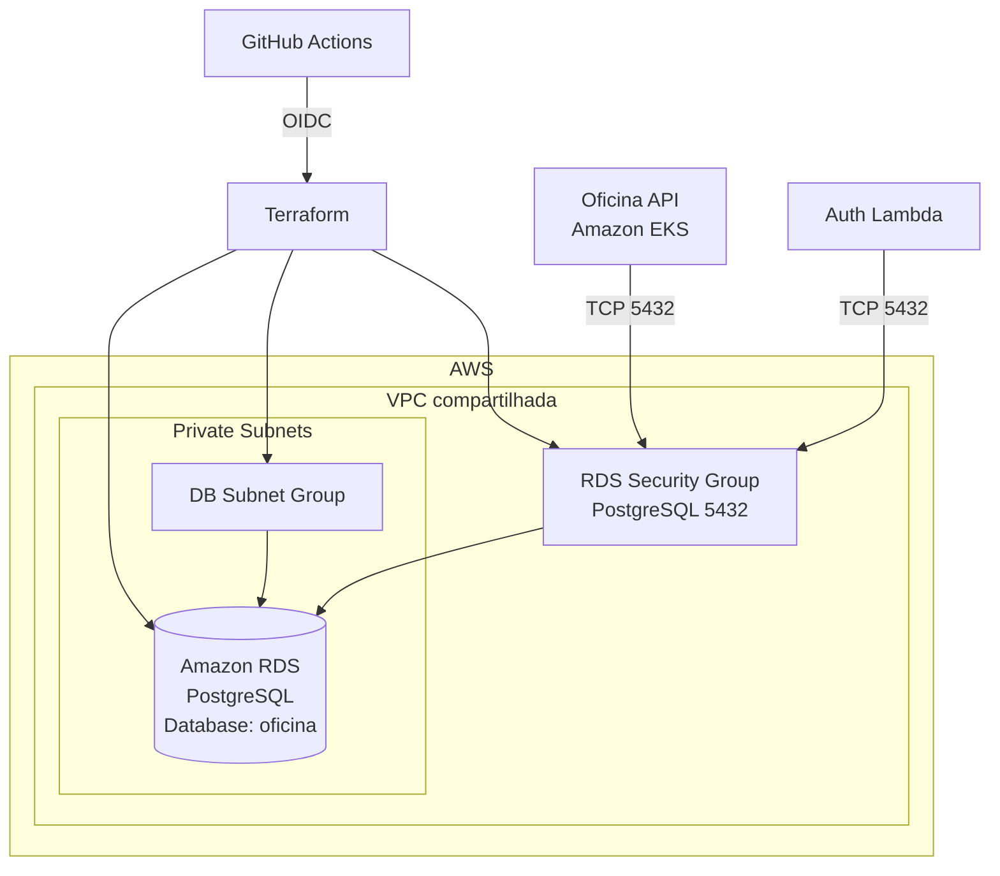

# Tech Challenge Oficina - Database Infra

Infraestrutura do banco de dados gerenciado da aplicação **Tech Challenge Oficina**, provisionada na AWS com **Terraform**.

Este repositório é responsável pelo provisionamento do **AWS RDS PostgreSQL** utilizado pelos serviços da solução.

## Responsabilidades

- Provisionar o banco PostgreSQL gerenciado no Amazon RDS.
- Criar o DB Subnet Group utilizado pela instância RDS.
- Criar o Security Group do RDS.
- Utilizar as subnets privadas da infraestrutura compartilhada.
- Expor outputs necessários para integração com a aplicação.

## Arquitetura

O banco de dados PostgreSQL é executado no Amazon RDS dentro das subnets privadas da VPC compartilhada. A instância está configurada com `publicly_accessible = false`, portanto não possui exposição pública direta.

O acesso à porta PostgreSQL (`5432`) é controlado por Security Group. Atualmente, a regra de entrada permite tráfego TCP na porta `5432` a partir do CIDR da VPC compartilhada.

A VPC e as subnets privadas não são criadas neste repositório. Elas são obtidas por data sources a partir da infraestrutura compartilhada criada pelo repositório `tech-challenge-oficina-k8s-infra`.

## Diagrama da arquitetura



## Tecnologias Utilizadas

- Terraform
- AWS
- Amazon RDS
- PostgreSQL
- Amazon VPC
- Security Groups
- S3 Remote Backend
- GitHub Actions
- GitHub OIDC/IAM

## Recursos Terraform

| Recurso | Tipo | Descrição |
| --- | --- | --- |
| `aws_db_instance.postgres` | Resource | Instância gerenciada PostgreSQL no Amazon RDS. |
| `aws_db_subnet_group.postgres` | Resource | Grupo de subnets privadas usado pelo RDS. |
| `aws_security_group.rds` | Resource | Security Group que controla o acesso ao banco. |
| `data.aws_vpc.shared` | Data source | Busca a VPC compartilhada por tags. |
| `data.aws_subnets.private` | Data source | Busca as subnets privadas da VPC compartilhada. |

## Configuração do PostgreSQL

| Configuração | Valor atual |
| --- | --- |
| Engine | `postgres` |
| Identificador da instância | `tech-challenge-oficina-postgres` |
| Database name | `var.db_name` com default `oficina` |
| Usuário administrador | `var.db_username` com default `oficina_admin` |
| Porta | `5432` |
| Classe da instância | `db.t4g.micro` |
| Storage inicial | `20` GB |
| Storage type | `gp3` |
| Storage encrypted | `true` |
| Max allocated storage | `0` (autoscaling de storage desativado) |
| Subnets | Subnets privadas obtidas da VPC compartilhada |
| Public access | `false` |
| Multi-AZ | `false` |
| Backup retention | `1` dia |
| Final snapshot no destroy | Desativado com `skip_final_snapshot = true` |
| Deletion protection | `false` |
| Performance Insights | `false` |
| Auto minor version upgrade | `true` |

Senhas e credenciais não devem ser armazenadas no repositório.

## Variáveis Terraform

| Nome | Descrição | Sensível | Default |
| --- | --- | --- | --- |
| `aws_region` | Região AWS usada para provisionar a infraestrutura do banco. | Não | `us-east-1` |
| `db_name` | Nome do banco PostgreSQL. | Não | `oficina` |
| `db_username` | Usuário administrador do banco PostgreSQL. | Não | `oficina_admin` |
| `db_password` | Senha do usuário administrador do banco PostgreSQL. Deve ser fornecida externamente. | Sim | Sem default |

O arquivo `terraform/terraform.tfvars.example` apresenta um exemplo de preenchimento das variáveis de banco. Não utilize senhas reais nesse arquivo.

## Outputs

| Output | Descrição |
| --- | --- |
| `rds_endpoint` | Endpoint da instância PostgreSQL no RDS. |
| `rds_port` | Porta da instância PostgreSQL no RDS. |
| `rds_database_name` | Nome do banco PostgreSQL. |
| `rds_security_group_id` | ID do Security Group associado ao RDS. |

## Remote State

O estado remoto do Terraform utiliza backend S3:

| Configuração | Valor |
| --- | --- |
| Bucket | `tech-challenge-oficina-terraform-state-b1cfa326` |
| Key | `database-infra/terraform.tfstate` |
| Região | `us-east-1` |
| Criptografia | `true` |
| Locking | `use_lockfile = true` |

O bucket S3 configurado como backend deve existir antes da execução do `terraform init`.

## Execução Local

Execute os comandos a partir do diretório `terraform`;

```bash
terraform init
terraform fmt -check
terraform validate
terraform plan
terraform apply
terraform destroy
```

Credenciais AWS válidas são necessárias para executar `plan`, `apply` e `destroy`, além de acesso ao bucket S3 usado como backend remoto. A variável sensível `db_password` deve ser fornecida externamente, por exemplo via variável de ambiente `TF_VAR_db_password` ou arquivo local não versionado.

## CI/CD

O workflow GitHub Actions está definido em `.github/workflows/ci-cd.yml` com o nome `Terraform CI/CD`.

Ele é executado em:

- `push` para as branches `homolog` e `main`;
- `pull_request` para as branches `homolog` e `main`;
- execução manual via `workflow_dispatch`.

### CI

O job `Terraform CI` executa no diretório `terraform`:

```bash
terraform fmt -check
terraform init -backend=false
terraform validate
```

Esse job não acessa o backend remoto, pois usa `terraform init -backend=false`.

### Deploy

O job de deploy executa somente em `push` ou `workflow_dispatch` para `homolog` ou `main`, após sucesso do CI.

Para deploy, o workflow:

- usa GitHub Environment `homolog` quando a branch é `homolog`;
- usa GitHub Environment `production` quando a branch é `main`;
- autentica na AWS via GitHub OIDC usando `aws-actions/configure-aws-credentials@v4`;
- assume a role definida em `vars.AWS_DEPLOY_ROLE_ARN`;
- injeta a senha do banco via secret `secrets.TF_VAR_DB_PASSWORD`;
- executa `terraform init`, `terraform plan -out=tfplan` e `terraform apply -auto-approve tfplan`.

O apply é automático apenas nos eventos de `push` ou `workflow_dispatch` das branches `homolog` e `main`.

## Estratégia de Branches

- `homolog`: ambiente de homologação.
- `main`: ambiente de produção.
- Alterações devem ser realizadas via Pull Request.
- Branches protegidas devem seguir o fluxo adotado no projeto para revisão e aprovação antes do merge.

## Segurança

- O banco é criado em subnets privadas.
- A instância RDS não possui exposição pública direta na configuração atual.
- O acesso à porta `5432` é controlado por Security Group.
- Credenciais não são armazenadas no repositório.
- Secrets e variáveis sensíveis são gerenciados fora do código, como secrets do GitHub Actions ou variáveis locais não versionadas.
- O deploy no GitHub Actions utiliza autenticação AWS via IAM/OIDC.

## Dependências entre Repositórios

Este repositório depende da infraestrutura de rede compartilhada criada por:

- `tech-challenge-oficina-k8s-infra`

Também fazem parte da solução:

- `tech-challenge-oficina-api`
- `tech-challenge-oficina-auth`

Esses repositórios podem consumir as informações expostas pelos outputs deste projeto para integração com o banco, sem que isso implique provisionamento direto entre eles neste repositório.

## Ordem de Provisionamento

A infraestrutura de rede compartilhada deve existir antes da criação do banco.

Ordem conceitual:

1. `tech-challenge-oficina-k8s-infra` cria a VPC e as subnets.
2. `tech-challenge-oficina-database-infra` cria o Amazon RDS PostgreSQL.

## Destruição

Como o RDS depende da VPC e das subnets privadas compartilhadas, o banco deve ser destruído antes da infraestrutura de rede da qual depende.
